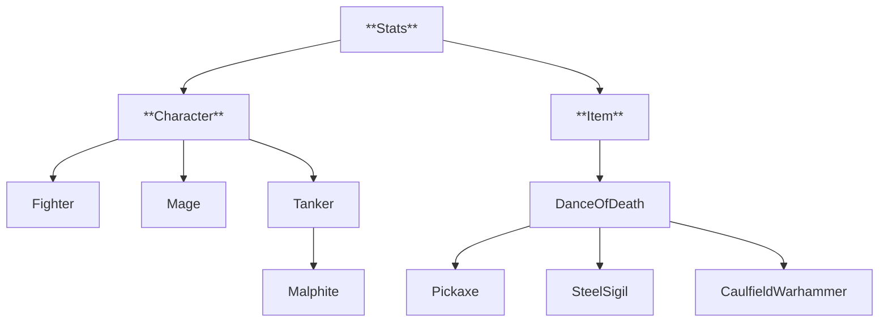

# class flowchart

# Classes

## Code
### [Stats](.\stats.py): 데미지, 유틸 및 각종 효과에 사용되는 능력치
### [Character](.\character.py): 챔피언 스탯 초기화, 스킬 등 각종 능력치 & 역할군
### [Champions](.\champions.py): 실제 챔피언의 스킬 목록과 효과 등(아직 미구현)
### [Items](.\items.py): 아이템 스탯 초기화, 계층 구조 등

## Config
### [Character](.\config\character.yaml): 챔피언 스탯, 스킬 정보
### [Items](.\config\items.yaml): 아이템 스탯 정보

## Utils
### [Information](.\utils\information.py): 파일 입출력 등
### [Skills](.\utils\skills.py): 스킬 관련 함수